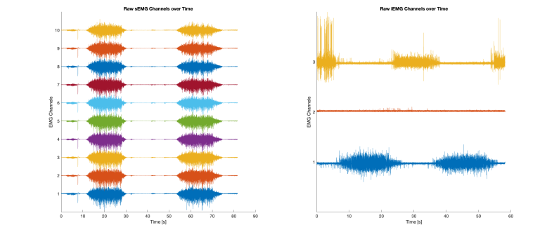
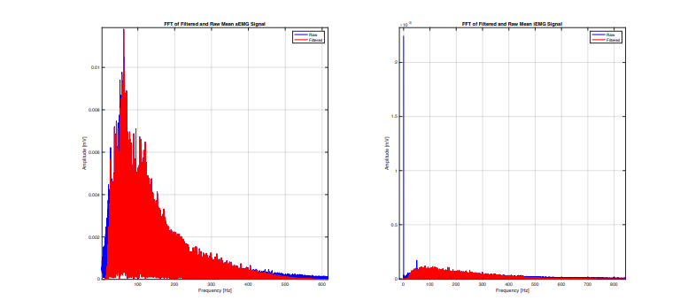
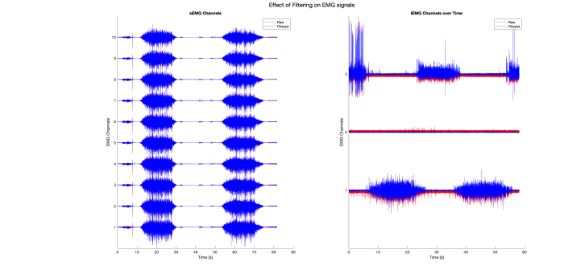
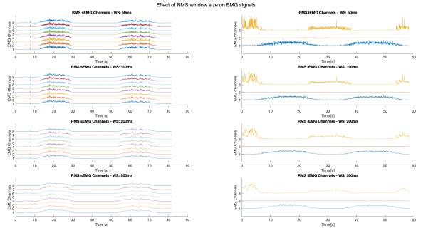
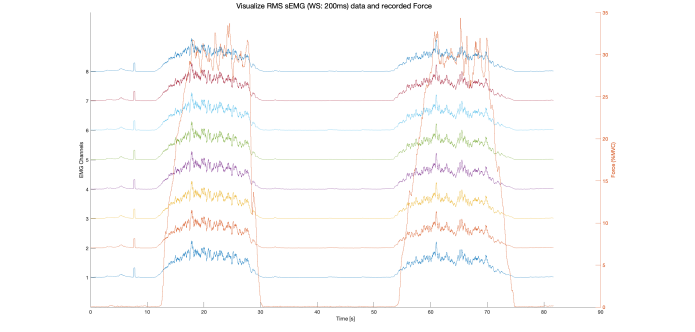
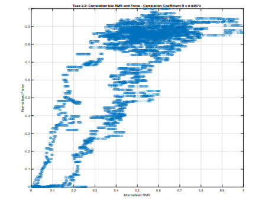
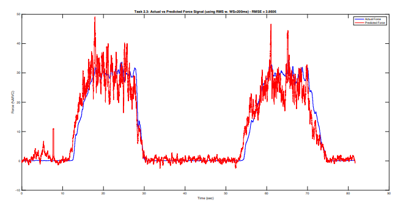

# 🧠 EMG Signal Processing & Force Prediction

A Python-based pipeline for processing **High-Density Surface EMG (HD-sEMG)** and **intramuscular EMG (iEMG)** signals, including filtering, frequency analysis, RMS envelope extraction, and muscle force prediction using linear regression.

---

## 📋 Table of Contents

- [Overview](#overview)
- [Project Structure](#project-structure)
- [Requirements](#requirements)
- [Installation](#installation)
- [Pipeline Walkthrough](#pipeline-walkthrough)
- [Results](#results)
- [Usage](#usage)

---

## Overview

This project processes two types of EMG recordings:

- **HD-sEMG** — 64-channel high-density surface EMG (stored in `Data_1.mat`)
- **iEMG** — 3-channel intramuscular EMG from FDS, ED distal, and ED proximal muscles (stored in `Data_2.mat`)

The pipeline covers signal loading, unit conversion, notch + bandpass filtering, spectral analysis, RMS envelope computation, and ultimately predicts muscle force output from EMG features using multiple linear regression.

---

## Project Structure

```
├── Data_1.mat               # HD-sEMG dataset (64 channels)
├── Data_2.mat               # iEMG dataset (3 channels)
├── emg_pipeline.py          # Main processing script
├── images/                  # Figures and diagrams
│   └── xyz.png
└── README.md
```

---

## Requirements

- Python 3.8+
- numpy
- scipy
- matplotlib
- scikit-learn

---

## Installation

```bash
git clone https://github.com/your-username/your-repo-name.git
cd your-repo-name
pip install numpy scipy matplotlib scikit-learn
python emg_pipeline.py
```

---

## Pipeline Walkthrough

### Task 1.1 — Load & Convert to mV

Both `.mat` files are loaded using `scipy.io`. The HD-sEMG signal is converted from raw ADC counts to millivolts using the conversion formula:

```
mV = (counts × 5) / (2^16 × 150) × 1000
```

Signals are transposed to `(samples × channels)` format for consistent downstream processing.

---

### Task 1.2 — Visualize Raw EMG Signals

Raw signals are plotted with a channel offset for visual clarity:

- **HD-sEMG**: First 10 of 64 channels displayed
- **iEMG**: All 3 channels (FDS, ED distal, ED proximal)

<<<<<<< Updated upstream

=======
<<<<<<< HEAD

=======

>>>>>>> 6d4eb2d7182d01cc57a742717824b00b95911061
>>>>>>> Stashed changes

---

### Task 1.3 — Filtering

Two filters are applied sequentially to both signal types:

| Filter | Type | Parameters |
|--------|------|------------|
| Notch | IIR Notch | 50 Hz, Q = 35 |
| Bandpass | 4th-order Butterworth | 20–500 Hz |

Both filters use zero-phase `filtfilt` to eliminate phase distortion.

---

### Task 1.4 — FFT Before and After Filtering

The mean signal across all channels is computed and its FFT is plotted before and after filtering, for both HD-sEMG and iEMG. This shows the removal of the 50 Hz power line noise and out-of-band frequencies.



---

### Task 1.5 — Raw vs. Filtered Overlay

Raw (blue dashed) and filtered (red solid) signals are overlaid for the first 10 HD-sEMG channels and all 3 iEMG channels, with a vertical offset applied per channel.



---

### Task 1.6.1 — HD-sEMG Channel Averaging

The 64 HD-sEMG channels are grouped into **8 groups of 8**, and the mean is computed within each group. This reduces dimensionality while preserving spatial information.

---

### Task 1.6.2 — Moving RMS Envelopes

A sliding-window RMS is computed using four window sizes:

| Window | HD-sEMG Samples | iEMG Samples |
|--------|----------------|--------------|
| 50 ms  | ~512 samples   | varies       |
| 100 ms | ~1024 samples  | varies       |
| 200 ms | ~2048 samples  | varies       |
| 500 ms | ~5120 samples  | varies       |

Results are plotted in a 4×2 grid (HD-sEMG and iEMG side by side for each window).



---

### Task 2.1 — RMS and Force on Dual Y-Axis

Using a 200 ms RMS window, the 8 averaged HD-sEMG group envelopes are plotted alongside the recorded force signal on a shared time axis with dual Y-axes.



---

### Task 2.2 — Correlation Between RMS and Force

The RMS of group 1 (channel 1) is normalized and correlated with the normalized force signal using the **Pearson correlation coefficient (R)**. A scatter plot visualizes the relationship.

```
R = Pearson correlation between normalized RMS and normalized force
```


---

### Task 2.3 — Force Prediction via Linear Regression

All 8 RMS group features (200 ms window) are used as inputs to a **multiple linear regression** model to predict the measured force signal.

Performance is evaluated using **Root Mean Squared Error (RMSE)**:

```
RMSE = sqrt(mean((predicted - actual)²))
```

Predicted (red) and measured (blue) force are displayed on dual Y-axes.



---

## Results

| Task | Metric | Value |
|------|--------|-------|
| 2.2 | Pearson R (RMS vs Force) | Computed at runtime |
| 2.3 | RMSE (Predicted vs Measured Force) | Computed at runtime |

---

## Usage

Simply run the main script after placing `Data_1.mat` and `Data_2.mat` in the same directory:

```bash
python emg_pipeline.py
```

All plots will display sequentially. No additional configuration is required.

---

## 📄 License

This project is for academic and research purposes.
